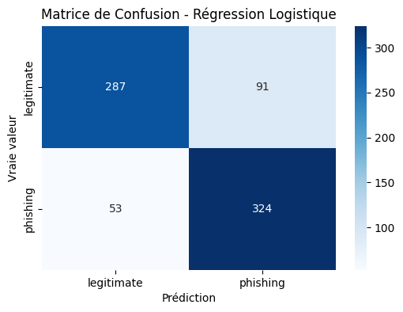
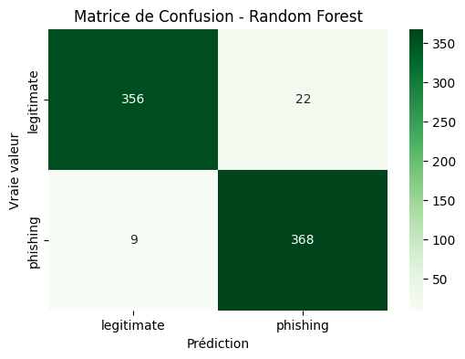

# Projet 2 : Classification d'URLs de Phishing via Machine Learning

## 1. Objectif du Projet

Ce projet a pour but de développer, entraîner et évaluer des modèles de Machine Learning destinés à la **classification automatique d'URLs**, afin de distinguer les sites légitimes des tentatives de phishing. L'objectif est de comparer l'efficacité de différents algorithmes sur un jeu de données riche en caractéristiques (features) extraites d'URLs.

## 2. Problématique et Contexte

Le phishing représente une menace persistante et coûteuse pour la sécurité des utilisateurs et des organisations. La capacité à identifier rapidement et précisément les URLs malveillantes est essentielle. Ce projet s'attaque à ce problème en explorant comment des techniques d'apprentissage automatique peuvent fournir une solution **scalable et efficace** pour cette tâche de classification critique en cybersécurité.

## 3. Dataset

Le jeu de données utilisé pour ce projet est le **"Phishing URL Classifier Dataset"** disponible sur Kaggle, publié par Hemanth Pingali.
* **Source :** [https://www.kaggle.com/datasets/hemanthpingali/phishing-url](https://www.kaggle.com/datasets/hemanthpingali/phishing-url)

Ce dataset comprend **3772 entrées** et est **parfaitement équilibré** (1886 URLs légitimes, 1886 URLs de phishing). Sa principale valeur ajoutée réside dans ses **87 caractéristiques pré-calculées**, qui décrivent divers aspects lexicaux, structurels, basés sur le contenu et sur la réputation des URLs (longueur, présence de caractères spéciaux, informations WHOIS, trafic web, etc.). Cela permet de se concentrer sur l'étape de modélisation. La variable cible à prédire est la colonne `status`.

*Note : Le fichier de données (`.parquet`) n'est pas inclus dans ce dépôt GitHub pour des raisons de taille et pour respecter les conditions de la source originale. Il est recommandé de le télécharger directement depuis Kaggle via le lien ci-dessus.*

## 4. Démarche Méthodologique

Le projet suit un pipeline classique de Machine Learning :

1.  **Chargement & Exploration (EDA) :** Importation du dataset au format `.parquet` via Pandas. Analyse exploratoire initiale pour comprendre la structure, les types de données et la distribution de la variable cible (`status`).
2.  **Préparation des Données (Preprocessing) :**
    * Séparation des variables indépendantes (X : les 87 features numériques) de la variable dépendante (y : `status`). La colonne `url` brute est exclue.
    * Encodage de la variable cible `status` ('legitimate' -> 0, 'phishing' -> 1) à l'aide de `LabelEncoder` de Scikit-learn.
    * Division **stratifiée** du jeu de données en ensembles d'entraînement (80%) et de test (20%) via `train_test_split` pour assurer la représentativité des classes dans les deux ensembles.
3.  **Modélisation & Évaluation (Modèle 1 - Référence) :**
    * Entraînement d'un modèle linéaire de base : **Régression Logistique**.
    * Évaluation approfondie sur l'ensemble de test : calcul de l'**Accuracy**, de la **Précision**, du **Rappel** (sensibilité), du **F1-Score** et analyse de la **Matrice de Confusion**.
4.  **Modélisation & Évaluation (Modèle 2 - Comparaison) :**
    * Entraînement d'un modèle d'ensemble plus complexe : **Random Forest Classifier** (avec 100 arbres).
    * Évaluation selon les mêmes métriques pour une comparaison directe.
5.  **Synthèse & Conclusion :** Analyse comparative des performances et formulation de recommandations basées sur les résultats.

## 5. Résultats et Évaluation Détaillée

### Modèle 1 : Régression Logistique

Ce modèle sert de baseline pour évaluer l'apport de modèles plus complexes.
* **Accuracy (Test) :** 80.93%
* **Précision (Classe 'phishing') :** 78.07%
* **Rappel (Classe 'phishing') :** 85.94%

**Rapport de Classification (Régression Logistique) :**
          precision    recall  f1-score   support
legitimate 0.84 0.76 0.80 378 phishing 0.78 0.86 0.82 377

accuracy                           0.81       755
macro avg 0.81 0.81 0.81 755 weighted avg 0.81 0.81 0.81 755

**Matrice de Confusion (Régression Logistique) :**

*(Interprétation : Le modèle identifie correctement 85.94% des URLs de phishing (Rappel), mais classe à tort 91 sites légitimes comme phishing (Faux Positifs) et manque 53 sites de phishing (Faux Négatifs).)*

### Modèle 2 : Random Forest Classifier

Ce modèle d'ensemble est généralement plus performant sur des données tabulaires complexes.
* **Accuracy (Test) :** **95.89%**
* **Précision (Classe 'phishing') :** 94.36%
* **Rappel (Classe 'phishing') :** **97.61%**

**Rapport de Classification (Random Forest) :**
          precision    recall  f1-score   support
legitimate 0.98 0.94 0.96 378 phishing 0.94 0.98 0.96 377

accuracy                           0.96       755
macro avg 0.96 0.96 0.96 755 weighted avg 0.96 0.96 0.96 755

**Matrice de Confusion (Random Forest) :**

*(Interprétation : Amélioration significative. Le modèle atteint un rappel de 97.61% pour le phishing, ne manquant que **9 URLs malveillantes (Faux Négatifs)**. Le nombre de Faux Positifs est également réduit à 22.)*

## 6. Conclusion et Perspectives

La comparaison des deux modèles montre clairement la supériorité du **Random Forest Classifier** pour cette tâche sur ce dataset spécifique. Avec une **accuracy de 95.89%** et surtout un **rappel très élevé (97.61%)** pour la détection de phishing, il minimise efficacement le risque le plus critique (les Faux Négatifs).

Ce résultat suggère que les relations entre les 87 caractéristiques et la nature malveillante d'une URL sont complexes et potentiellement non-linéaires, ce que le Random Forest modélise mieux qu'un simple modèle linéaire.

**Perspectives :**
* Optimisation des hyperparamètres du Random Forest (GridSearchCV/RandomizedSearchCV).
* Exploration d'autres modèles (Gradient Boosting, SVM, réseaux de neurones simples).
* Analyse de l'importance des features (quelles caractéristiques sont les plus prédictives ?).
* Test sur des datasets plus larges ou différents pour évaluer la généralisation.

## 7. Compétences Démontrées

* **Analyse Exploratoire de Données (EDA)** : Compréhension et interprétation de datasets structurés.
* **Préparation de Données (Preprocessing)** : Nettoyage, encodage de variables catégorielles, division train/test stratifiée.
* **Machine Learning (Classification)** : Mise en œuvre, entraînement et évaluation de modèles (Régression Logistique, Random Forest) avec Scikit-learn.
* **Évaluation de Modèles** : Utilisation et interprétation de métriques clés (Accuracy, Précision, Rappel, F1-Score, Matrice de Confusion) dans un contexte de cybersécurité.
* **Visualisation de Données** : Création de visualisations pertinentes (Matrices de Confusion) avec Matplotlib et Seaborn.
* **Outils** : Maîtrise de Python, Pandas, Scikit-learn, Matplotlib, Seaborn dans l'environnement Google Colab / Jupyter.
* **Résolution de Problèmes** : Application concrète du ML à un cas d'usage de cybersécurité (détection de phishing).
* **Documentation & Communication** : Rédaction d'un `README.md` détaillé présentant
